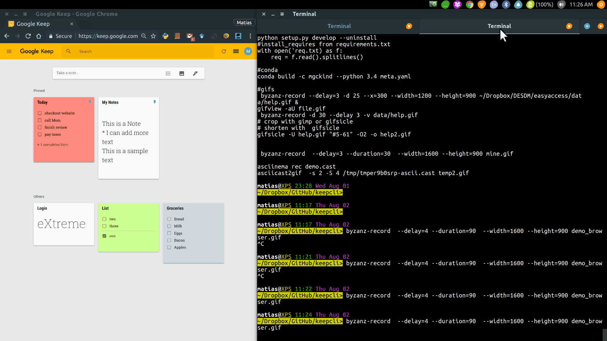

# keepcli    

A simple and unofficial interactive command line interpreter client for [Google Keep](https://keep.google.com/).

It uses the nice unofficial API client [gkeepapi](https://github.com/kiwiz/gkeepapi) 

As described also in that repository, *keepcli* is not supported nor endorsed by Google.

## Examples

Let's see how everything is synchronized with the web interface. 

## Development

I wanted a simple cli tool that can easily be in sync with multiple devices and although there are alternatives like [todo.txt](http://todotxt.org/) which is an awesome tool, I prefered to keep my quick TODO's and notes in Google Keep, however there is not a public API for it nor a similar cli (given my shallow search).

As a very active [Google Keep](https://keep.google.com/) user (among other Notes-taking tools) I developed this for my own needs during some free time, mainly to add, check/uncheck and move  TODO items from various lists  and add notes quickly when working from a terminal screen which is very often. It's been very productive to get things done and have multiple TODO list up to date and move items between them among others, it has a nice TAB autocompletion for some of the useful commands. Might be useful for others in a similar situation. I also keep track of dailiy activities, and things to do during the current and next week, moving items and pinning notes.

Some offline features have not tested in too much detail and there might be some hidden issues, this is note a production-grade tool and is distributed 'as is'.

I'll keep adding features as they are needed, based on my free time, contributions are welcome. 

## Current version

**keepcli 1.0.1**

## Installation

Uses `python3`

For development version:

    pip install git+https://github.com/mgckind/keepcli.git

or latest version:

    pip install keepcli

Its better to set up the App Password for Keep [here](https://myaccount.google.com/apppasswords) to authenticate.

## Usage

From a terminal window:

    keepcli
 
Inside `keepcli` you can type `help` to see a list of useful commands:

    keepcli [] ~> help

## Some Features

- TAB autocompletion
- Keep constant sync with Google Keep
- Create list/note with `create`
- Change card color
- Pin/Unpin card
- add/check/uncheck/delete items from a list
- move items from a list to another 
- dump/load Google Keep entries for offline work
- add text to Notes
- useful shorcuts
- show checked/unchecked items from lists

## Wishlist

- Add labels
- Add reminders
- Add ability to change users
- Add sub-items to list
- Many more
